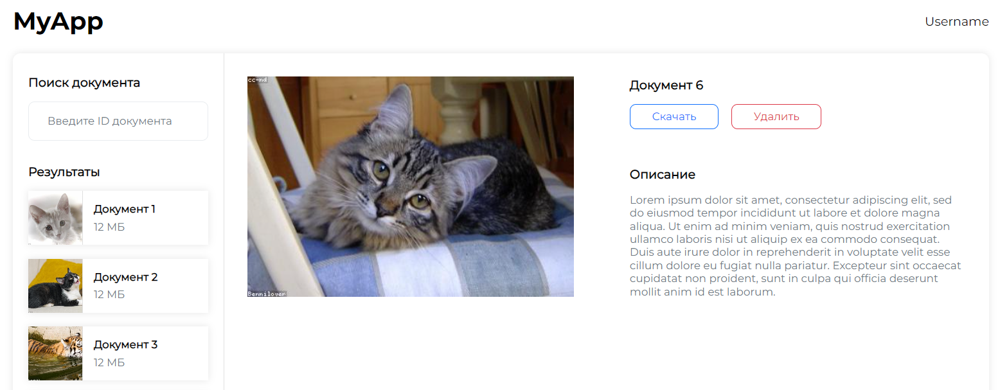

# documents-app

## Document page with search and preview using Vue 3 (Composition API), Pinia and TypeScript
- loading data from API (if the result returned an error (request parameters are incorrect or server error), the error is displayed to the user)
- responsive website layout (look good on all devices >= 320px)
- component approach 
- BEM methodology
- downloading the selected document in .txt format
## Figma template
https://www.figma.com/file/xtAnJSWrI8khixoMeLzN3R/CISM-Frontend-Test-App-(Copy)?type=design&node-id=702-1284&mode=design




## Project setup
```
npm install
```

### Compiles and hot-reloads for development
```
npm run serve
```

### Compiles and minifies for production
```
npm run build
```

### Lints and fixes files
```
npm run lint
```

### Customize configuration
See [Configuration Reference](https://cli.vuejs.org/config/).
